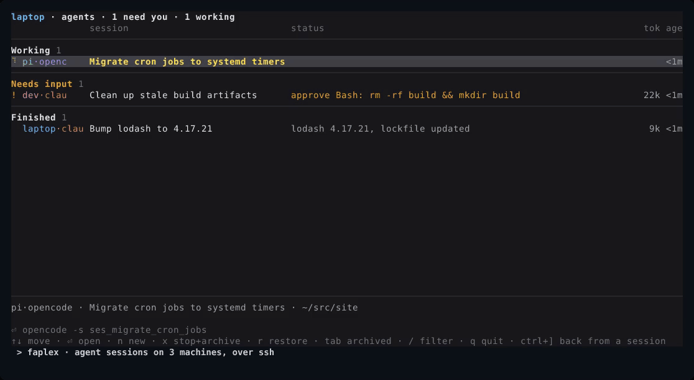

# faplex

Like `claude agents`, but for all your harnesses and all your machines.



**F**ake **a**gent (multi)**plex**er: a status list for the Claude Code, Codex and OpenCode
sessions you already have, on every machine you can `ssh` to. Fake because it multiplexes
nothing. The harnesses keep their own sessions running; faplex reads what they report and
opens the harness's own CLI on the row you pick.

- **One grouped, prioritized, real-time list.** Working, Needs input, Finished, across every
  machine and harness, with context tokens and subagent counts.
- **No setup on top of your harnesses.** No hooks, plugins or wrapper to launch through, and
  nothing to install on remote machines: plain ssh and what the harness daemons already expose.
- **It opens the real CLI.** A row is `claude attach`, `codex resume` or `opencode -s` handed
  your terminal, so every harness feature works and looks the way it does without faplex.
- **No windows kept running.** No pane or client per session. One starts when you open a row
  and is closed after 15 minutes out of view; the agent carries on in its daemon.
- **The keys you know from `claude agents`.** ↑↓ to move, → to open, ← to come back.
- **Sessions started anywhere show up**, not only the ones you start from faplex.
- **Safe to quit.** It holds nothing the sessions depend on.

```sh
bunx faplex              # runs without installing; `npx faplex` works too
bun add -g faplex        # or install the `faplex` command (`npm i -g faplex` likewise)
faplex devbox pi         # this machine plus two ssh hosts, no config needed
```

faplex runs on [Bun](https://bun.sh). Started through npm or npx it finds the `bun` on your
PATH, and tells you how to install it if there is none.

## How it compares

✅ yes · ⚠️ partly · ❌ no

| | faplex | [Agent Deck](https://github.com/asheshgoplani/agent-deck) | [Herdr](https://herdr.dev) | [gctrl](https://www.npmjs.com/package/gctrl) | [Paseo](https://paseo.sh) | [T3 Code](https://github.com/pingdotgg/t3code) |
|---|---|---|---|---|---|---|
| No setup beyond the harness | ✅ | ⚠️ launch through it, install hooks | ⚠️ becomes your terminal | ✅ | ❌ its own daemon | ❌ its own server |
| Lists sessions started elsewhere | ✅ | ❌ only its own | ⚠️ only in its panes | ✅ | ❌ only its own | ❌ only its own |
| Idle sessions cost nothing extra | ✅ | ❌ a live CLI each | ❌ a live CLI each | ✅ | ⚠️ its daemon | ⚠️ its server |
| You work in the harness's own UI | ✅ | ✅ in tmux | ✅ in its pane | ✅ | ❌ its UI | ❌ its UI |
| Live status | ✅ from the harness daemon | ⚠️ hooks, else pane parsing | ✅ reported from its panes | ⚠️ read off session files | ✅ | ✅ |
| Several machines | ✅ ssh | ✅ ssh | ✅ ssh | ❌ | ✅ | ✅ |
| Starts new sessions | ✅ | ✅ | ✅ | ❌ | ✅ | ✅ |
| Works with a harness that has no daemon | ❌ view only | ✅ | ✅ | ✅ | ⚠️ supported providers | ⚠️ supported providers |
| Splits and layouts | ❌ | ⚠️ tmux's | ✅ | ❌ | n/a, own app | n/a, own app |
| One UI for permissions, history, diffs | ❌ | ❌ | ❌ | ❌ | ✅ | ✅ |

Filled in from each project's docs in October 2026; corrections welcome. Close relatives:
Claude Squad (like Agent Deck), cmux (like Herdr), rejoin (like gctrl).

The short version: faplex owns neither the terminal nor the conversation. Agent Deck and Herdr
own the terminal, which gets them persistent panes for any CLI at the price of a client per
session. Paseo and T3 Code own the conversation, which gets them one UI everywhere at the price
of integrating deeply with every provider. gctrl is the nearest relative: same hands-off stance,
but local only, no new sessions, and status inferred from files.

## What can break

faplex asks very little of a harness: a list of sessions with a status, a command that attaches
to one by id, and a command that starts one (the [Providers](#providers) table is the whole
contract). It never parses terminal output or speaks a harness's conversation protocol, so a
harness can change its UI, its tools and its transcript rendering without faplex noticing.

What it does depend on is young: `claude agents --json`, the OpenCode 2.x service API and the
Codex app-server socket are all recent, and a change to one needs an adapter fix. When that
happens the damage is contained: every response is schema-checked, so one harness on one machine
shows an error above the list and the rest of the list keeps working. Context tokens and subagent
counts lean on more (Claude's are read from its transcript files); they are optional and drop
out on their own without affecting the list.

## Config

None is needed: with no file, faplex lists this machine, called `local`. Other machines can be
named on the command line. `faplex devbox pi` lists this machine plus those two for this run:
an argument is a machine `id` from the config file, else an ssh alias/host. Nothing is written.

To keep them, `~/.config/faplex/config.json`, every key optional:

```json
{
  "$schema": "https://raw.githubusercontent.com/kkrausse/faplex/main/schema.json",
  "machines": [
    { "id": "laptop" },
    { "ssh": "devbox", "dir": "~/src", "short": "dev" },
    { "ssh": "pi" }
  ],
  "archiveAfterHours": 24,
  "closeHiddenAfterMinutes": 15
}
```

- `machines`: the machines besides this one. This machine is always listed; an entry without
  `ssh` is this machine and can rename it or set its other fields.
  - `ssh`: an alias/host from your ssh config (key auth; the dashboard never prompts).
  - `id`: the name shown in the list. Defaults to `ssh`, or to `local` for this machine.
  - `short`: a shorter name for list rows (e.g. `"dev"`); the footer and new-session picker keep `id`.
  - `dir`: default start directory for new sessions there (default `~`).
  - `color`: label color for the host (hex); defaults to a palette color by position in the list.
  - `path`: extra PATH entries on the host. `~/.local/bin`, `~/.bun/bin` and
    `~/.opencode/bin` are always added, since non-interactive ssh skips `.bashrc`.
- `archiveAfterHours` (default 24): a finished session untouched for this long moves to
  Archived. This is the knob for how quickly Finished empties.
- `closeHiddenAfterMinutes` (default 15): how long a session client you aren't looking at is
  kept before it is closed.

`$schema` gives editors completion and checking. A file that doesn't fit stops faplex at
startup with the path and the field. An older `machines.json` (just the `machines` array) is
still read when there is no `config.json`.

All ssh traffic to a host shares one connection (ControlMaster sockets in
`~/.local/state/faplex/ssh`). sshd allows 10 sessions per connection by default
(`MaxSessions`); each open remote pane and the host's status loop take one.

## List

Sections: **Working**, **Needs input**, **Finished** (done, failed, interrupted, idle) and
**Archived** (collapsed; ↓ past the last row above it opens it, moving back up closes it). Each row is `machine·harness`, title, status line, then
**subs** (active/total subagents), **tok** (tokens in the context window) and **age** (time
since the last update). A `⑂` or `$` after the status mark means subagents or a shell are still
running behind the row (Claude only so far): a question asked with a dev server up is still
Needs input, and a finished turn with one left running is still Finished. A session is archived when its harness archived it, you archived it
here, or it has been finished and untouched for 24 hours (`archiveAfterHours`). Archiving here is not final: opening
the session, or anything happening in it afterwards, brings it back. Unprompted drafts are hidden.

Failed turns are at the top of Finished. A line above the list appears when something needs
you: a machine that can't be reached or a harness whose answer couldn't be read (red; that
source's last known rows stay, dimmed), and a harness that is installed but whose daemon isn't
running, with the command that starts it (`codex app-server daemon start`,
`opencode service start`). Harnesses that aren't installed are listed dimly at the bottom.

[docs/design.md](docs/design.md#list) has the details: ordering, how each harness's token and
subagent numbers are measured, and where archive marks live.

## Keys

List: ↑↓/jk move · ⏎/→ open · n new · x stop + archive · r restore · R reattach ·
tab into/out of archived · / filter · q quit.

`R` is for a session pane that looks stale or stuck: it closes the client faplex kept for that
session and attaches a new one. The agent itself isn't touched.

`x` moves the row to Archived at once, then in the background stops whatever is still running
in the session, so an archived session can't wake itself up later (a Claude `/loop` or
scheduled wakeup), and writes the mark. With Archived shown, the row is red with a spinner
until that is done. If the stop fails the session is archived anyway and stays red (the
Archived heading says how many are still running); `x` on it tries the stop again.
The conversation is kept either way; opening the session resumes it and takes it out of the archive.

`faplex --help` has the command line. `faplex ps` lists the running dashboards and marks the ones whose terminal is gone;
`faplex kill` stops those (`faplex kill all` stops every one). Sessions are not affected.

New session: ↑↓ machine · ←→ harness · tab edit start dir · ⏎ open · esc back.
Combinations whose harness is missing or unsupported are greyed out.

In an open session, go back to the list with:

- ctrl+] anywhere
- ← on an empty prompt

Every other key, ctrl+c included, goes to the harness. The client stays alive in the
background (●) and repaints when reopened; clients not shown for 15 minutes
(`closeHiddenAfterMinutes`) are closed. Opening a session clears the terminal's screen and scrollback first. An unused new chat is cached for reuse ("·ready")
and stays out of the list; `n` reopens the picker on it.

## Providers

What a harness needs to appear here, per machine:

- **A daemon that owns its sessions**, so they outlive any client, including the dashboard's pane.
- **Presence**: a cheap check that says installed / too old / daemon not running (not errors: the
  first two are shown dimly, the last with the command that starts the daemon).
- **List**: every session with id, title, cwd, last update, model, whether the harness archived it,
  and a status that maps onto `working | needs | done | failed | interrupted | idle`. Activity
  (working, needs input) must come from the live process, not from a self-reported note.
- **Change signal**: an event stream that triggers a re-list, or polling. Polling also re-lists on
  demand, which the dashboard asks for when you leave a pane.
- **Open**: a CLI that attaches to a session by id in a terminal (run over ssh for remote machines).
- **New**: a CLI that starts a session in a directory, plus a way to recognise it in the list (an
  id it prints, or the first new session in that directory).
- **Stop** (optional): end whatever is still running so nothing starts again unprompted. `x` runs it
  before archiving. A harness whose sessions can wake themselves (Claude's `/loop`, scheduled
  wakeups) must stop the process; one that only runs when prompted just interrupts the turn.

| Harness | Status | Open | New | Stop |
|---|---|---|---|---|
| Claude Code | per-host sh loop: `claude agents --json --all` + `~/.claude/jobs/<id>/state.json` every 2 s | `claude attach <id>` | `claude --bg`, then attach | `claude stop <id>` (ends the process and its wakeups; background sessions only) |
| OpenCode 2.x | background service HTTP API (`~/.local/state/opencode/service.json`, basic auth user `opencode`), re-read on `/api/event` events | `opencode -s <id>` | `opencode <dir>` | `POST /api/session/<id>/interrupt` |
| OpenCode Mini | same OpenCode service and live updates | `opencode mini -s <id>` | create a tagged session, then `opencode mini -s <id>` in the chosen directory | same OpenCode interrupt |
| Codex | app-server daemon, WebSocket over `~/.codex/app-server-control/app-server-control.sock`, re-read on thread notifications | `codex resume <id>` | `codex -C <dir>` | `turn/interrupt` on the in-progress turn |

The new-session picker offers `opencode` and `opencode-mini` separately; list rows show
`oc` and `ocm`. Mini is the minimal, scrollback-style interface shipped in the same
OpenCode executable, so it updates with OpenCode. Faplex stores the Mini choice in
session metadata (`faplex.interface: mini`), preserving it across dashboard restarts
and machines. Both choices share one status connection and each session appears only
once. Untagged sessions, including ones started outside faplex, default to `oc`.

Remote OpenCode ports and Codex sockets are forwarded over the shared ssh connection.
OpenCode 1.x and Claude Code without `agents --json` show as unsupported.

Interactive Claude sessions (plain `claude` in another terminal) are listed but
marked `view`: `claude attach` only accepts background jobs.

## From a checkout

```sh
ln -s "$PWD/bin/faplex" ~/.local/bin/faplex
```

`bin/faplex` runs a standalone build in `dist/` and rebuilds it (under a second) whenever the
source is newer. `bun start` runs straight from source. [docs/design.md](docs/design.md) covers
how it works.

`e2e/` is an integration rig: docker compose starts three machines that ssh to each other, each
with the real Claude Code, Codex and OpenCode pointed at a fake model API, and seeds a few
sessions (`e2e/compose.yaml` lists the commands). The demo above is recorded on it:
`e2e/record.sh` writes `e2e/out/demo.gif`, which is copied to `docs/demo.gif`.
